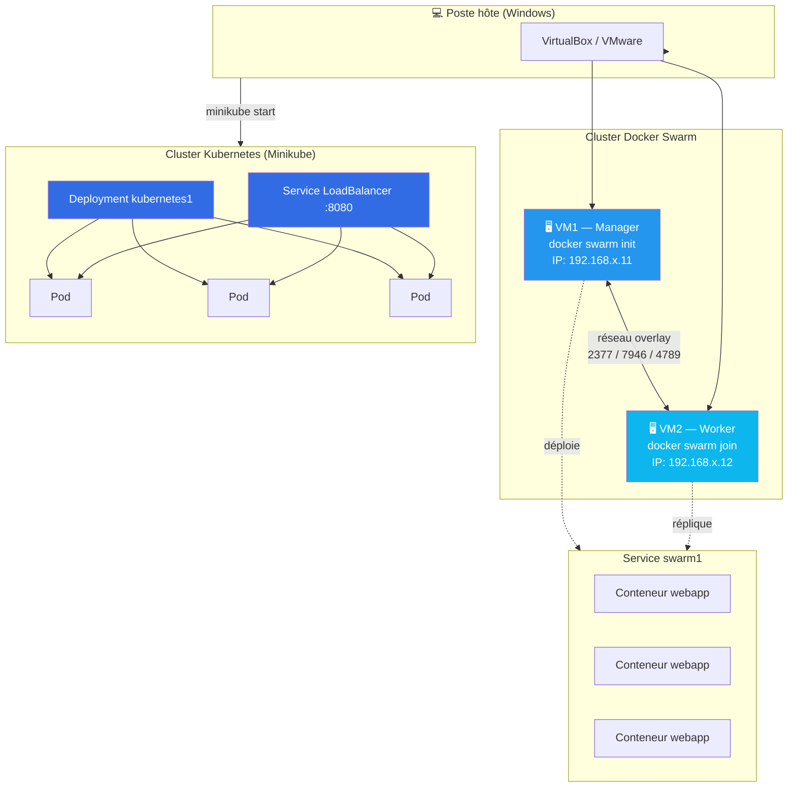

# TP1 – Docker Swarm & Kubernetes

[](https://www.docker.com/)
[](https://docs.docker.com/engine/swarm/)
[](https://minikube.sigs.k8s.io/)
[](LICENSE)

Mise en œuvre d'un cluster **Docker Swarm** à deux nœuds (manager + worker) et d'un cluster **Kubernetes** local (Minikube), pour déployer, mettre à l'échelle, mettre à jour et superviser une application web conteneurisée.

> Projet réalisé dans le cadre du module *Ingénierie des Infrastructures Big Data et Cloud* — II BDCC.

---

## Sommaire

- [Architecture](#architecture)
- [Prérequis](#prérequis)
- [Structure du dépôt](#structure-du-dépôt)
- [Partie 1 — Docker Swarm](#partie-1--docker-swarm)
- [Partie 2 — Kubernetes (Minikube)](#partie-2--kubernetes-minikube)
- [Comparatif Swarm vs Kubernetes](#comparatif-swarm-vs-kubernetes)
- [Dépannage](#dépannage)
- [Auteur](#auteur)

---

## Architecture



Le cluster Swarm utilise un **routing mesh** : le port publié (`8080`) répond sur chaque nœud, même ceux qui n'exécutent aucune réplique du service. Le cluster Kubernetes expose l'application via un `Service` de type `LoadBalancer`, qui répartit le trafic entre les pods du `Deployment`.

---

## Prérequis

| Outil | Usage |
|---|---|
| VirtualBox ou VMware Workstation | Hyperviseur pour les VM Swarm |
| Ubuntu Server (dernière LTS) | Système des VM |
| Docker Engine | Moteur de conteneurs + Swarm |
| Minikube + kubectl | Cluster Kubernetes local |
| Git | Cloner / pousser ce dépôt |

---

## Structure du dépôt

```
docker-swarm-k8s-tp/
├── README.md                    # ce fichier
├── LICENSE
├── webapp/
│   ├── Dockerfile                # image webapp (Nginx + page statique)
│   └── index.html                # page "welcome bdcc V1"
└── scripts/
    ├── 01-setup-vm.sh             # identité + Docker sur chaque VM
    ├── 02-swarm-init.sh           # initialisation du manager (vm1)
    ├── 03-swarm-join.sh           # rattachement du worker (vm2)
    ├── 04-swarm-service.sh        # cycle de vie complet du service swarm1
    ├── 05-swarm-ha-drain.sh       # haute disponibilité (drain/active)
    └── 06-kubernetes.sh           # déploiement Kubernetes (Minikube)
```

Chaque script correspond à une étape du TP et peut être exécuté indépendamment ; les commandes qu'il contient sont aussi commentées.

---

## Partie 1 — Docker Swarm

### 1. Préparer les deux VM

Sur **chaque** VM (vm1 et vm2) :

```bash
bash scripts/01-setup-vm.sh
```

Installe Docker Engine, configure l'utilisateur courant dans le groupe `docker`, et affiche l'adresse IP à noter.

### 2. Initialiser le manager (sur vm1)

```bash
bash scripts/02-swarm-init.sh <IP_VM1>
```

Affiche la commande `docker swarm join` à copier vers vm2.

### 3. Rejoindre le cluster (sur vm2)

```bash
bash scripts/03-swarm-join.sh "<commande copiée>"
```

### 4. Cycle de vie du service (sur vm1)

```bash
bash scripts/04-swarm-service.sh
```

Ce script exécute, dans l'ordre :
1. Build de l'image `webapp` à partir de `webapp/Dockerfile`
2. Création du service `swarm1`
3. Publication du port `8080`
4. Montée à 5 réplicas
5. Mise à jour vers `webapp:v2`, puis retour arrière (`rollback`)

### 5. Haute disponibilité (sur vm1)

```bash
bash scripts/05-swarm-ha-drain.sh <nom_du_noeud_worker>
```

Simule une maintenance : bascule les tâches du worker vers le manager, puis les réactive et rééquilibre.

---

## Partie 2 — Kubernetes (Minikube)

Sur le poste hôte (PowerShell) :

```powershell
minikube start --driver=docker
bash scripts/06-kubernetes.sh
```

Le script déploie `webapp`, l'expose en `LoadBalancer`, le scale à 3 réplicas, puis nettoie l'environnement (service, déploiement, cluster).

---

## Comparatif Swarm vs Kubernetes

| Critère | Docker Swarm | Kubernetes |
|---|---|---|
| Installation | Intégrée à Docker | Minikube / kubeadm / cloud |
| Unité de déploiement | Service / tâche | Deployment / Pod |
| Mise à l'échelle | `docker service scale` | `kubectl scale` |
| Mise à jour | `service update --image` / `rollback` | `set image` / `rollout undo` |
| Exposition | Routing mesh | Service (ClusterIP / NodePort / LoadBalancer) |
| Tableau de bord | Aucun natif | Dashboard officiel |

---

## Dépannage

- **IP identiques après clonage de VM** : régénérer l'adresse MAC de la VM clonée (`VBoxManage modifyvm "<nom>" --macaddress1 auto`), puis redémarrer.
- **`permission denied` sur le socket Docker** : `sudo usermod -aG docker $USER`, puis se reconnecter.
- **`docker swarm join` en timeout** : vérifier que l'IP du manager utilisée dans le token est bien son IP actuelle (`ip -br a`), et que les ports 2377/7946/4789 sont ouverts.
- **`ErrImagePull` sous Kubernetes** : utiliser un tag explicite (`webapp:v1`) et `minikube image load`, `latest` n'étant pas re-résolu de la même façon.

---

## Auteur

**[Votre nom]** — Filière II BDCC, UH2C / ENSET Mohammedia
Module : Ingénierie des Infrastructures Big Data et Cloud — Pr. Kamal EL GUEMMAT

## Licence

Ce projet est sous licence MIT — voir le fichier [LICENSE](LICENSE).
